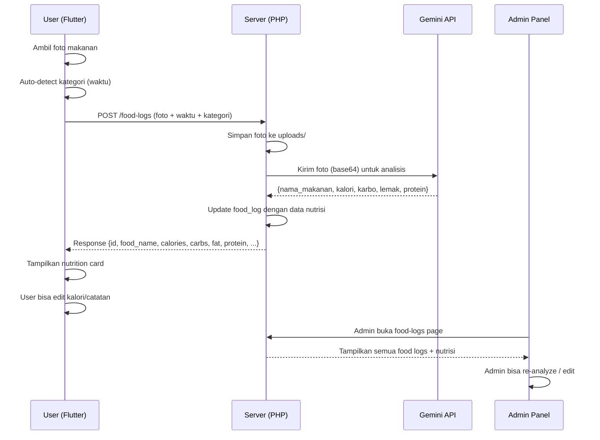

# Integrasi AI Nutrition Analyzer ke Vegie App

Mengintegrasikan fitur analisis nutrisi makanan via AI (Gemini API) dari prototype `Ref/cek.php` ke dalam ekosistem Vegie App. Mencakup: modifikasi database, API server, admin panel, dan aplikasi Flutter Android.

## User Review Required

> [!IMPORTANT]
> **Gemini API Key**: Akan menggunakan API key yang ada di [config.php](file:///c:/xampp/htdocs/Vegie/Ref/config.php) (`AIzaSyBH...`). Apakah key ini masih aktif dan valid untuk production?

> [!WARNING]
> **Biaya API**: Setiap foto yang di-upload akan memanggil Gemini API untuk analisis. Ini berarti setiap food log baru dengan foto = 1 API call. Apakah ini acceptable?

> [!IMPORTANT]
> **Perubahan Database**: Menambahkan 4 kolom baru ke tabel `food_logs` (calories, carbs, fat, protein). Data food log lama akan memiliki nilai `NULL` untuk kolom nutrisi.

## Open Questions

> [!IMPORTANT]
> 1. **Fallback jika AI gagal**: Jika Gemini API gagal/timeout, apakah food log tetap disimpan tanpa data nutrisi, atau ditolak?
>    - **Rekomendasi**: Tetap simpan, nutrisi bisa diisi manual nanti.
> 2. **Apakah perlu Ollama sebagai fallback** seperti di `cek.php`, atau cukup Gemini saja?
>    - **Rekomendasi**: Gemini saja untuk production, Ollama bisa ditambahkan nanti.
> 3. **Apakah user bisa menambah food log tanpa foto?** 
>    - Saat ini foto optional. Jika tanpa foto, data nutrisi tidak bisa diisi otomatis oleh AI. User harus isi manual.
>    - **Rekomendasi**: Foto **wajib** agar AI selalu bisa menganalisis, atau tetap opsional dengan nutrisi kosong jika tanpa foto.

---

## Proposed Changes

### Komponen 1: Database Schema

Menambah kolom nutrisi ke tabel `food_logs` agar data kalori, karbohidrat, lemak, dan protein bisa disimpan.

#### [MODIFY] [lovingharmony.sql](file:///c:/xampp/htdocs/Vegie/database/lovingharmony.sql)

Tambah kolom ke tabel `food_logs`:

```sql
ALTER TABLE food_logs
  ADD COLUMN calories FLOAT DEFAULT NULL AFTER nutrition_notes,
  ADD COLUMN carbs FLOAT DEFAULT NULL AFTER calories,
  ADD COLUMN fat FLOAT DEFAULT NULL AFTER carbs,
  ADD COLUMN protein FLOAT DEFAULT NULL AFTER fat;
```

---

### Komponen 2: API Server (Backend PHP)

#### [MODIFY] [FoodLogController.php](file:///c:/xampp/htdocs/Vegie/api/controllers/FoodLogController.php)

- **`store()`**: Setelah menyimpan food log, jika ada foto, panggil Gemini API untuk analisis nutrisi. Simpan hasil (calories, carbs, fat, protein) ke database. Jika AI gagal, kolom nutrisi tetap `NULL`.
- **`index()`/`show()`**: Sertakan kolom nutrisi (calories, carbs, fat, protein) dalam response JSON.
- **`update()`**: Izinkan update manual kolom nutrisi (calories, carbs, fat, protein).

#### [NEW] [NutritionAnalyzer.php](file:///c:/xampp/htdocs/Vegie/api/helpers/nutrition_analyzer.php)

Helper baru untuk analisis nutrisi via Gemini API. Mengadopsi logic dari [cek.php](file:///c:/xampp/htdocs/Vegie/Ref/cek.php):
- Kompresi gambar ke 800px via GD (sebelum encode ke base64, bukan menyimpan)
- Kirim ke Gemini `gemini-2.5-flash`
- Parse response JSON → return `['nama_makanan', 'kalori', 'karbohidrat', 'lemak', 'protein']`
- Return `null` jika gagal (graceful failure)
- API key dibaca dari environment config

#### [MODIFY] [index.php](file:///c:/xampp/htdocs/Vegie/api/index.php)

- Tambah route `POST /food-logs/{id}/analyze` untuk re-analyze foto yang sudah ada (trigger manual dari admin).

---

### Komponen 3: Admin Panel

Menambah halaman Food Logs di admin panel agar admin bisa melihat food log yang di-upload user beserta data nutrisinya.

#### [NEW] [admin/pages/food-logs/index.php](file:///c:/xampp/htdocs/Vegie/admin/pages/food-logs/index.php)

Halaman daftar food logs semua user:
- Tabel: User, Foto (thumbnail), Makanan, Kategori, Kalori, Waktu
- Filter by user, kategori, tanggal
- Klik baris → buka detail

#### [NEW] [admin/pages/food-logs/detail.php](file:///c:/xampp/htdocs/Vegie/admin/pages/food-logs/detail.php)

Halaman detail food log individual (mengadopsi desain dari gambar referensi):
- Tampilkan foto makanan (klik untuk fullscreen)
- Nama makanan (bold, besar)
- Info: "ESTIMASI KANDUNGAN PER PORSI"
- Card **Total Energi / Kalori** (highlight biru)
- Progress bar: Karbohidrat (amber), Lemak (kuning), Protein (merah) — dengan nilai gram
- Tombol **"Re-Analyze"** untuk trigger ulang AI jika data nutrisi kosong/salah
- Tombol **"Edit"** untuk edit manual kalori/nutrisi
- Tampilkan catatan user (nutrition_notes)

#### [MODIFY] [sidebar.php](file:///c:/xampp/htdocs/Vegie/admin/includes/sidebar.php)

Tambahkan menu "Food Logs" di sidebar admin, di section "Management":

```
📊 Food Logs → pages/food-logs/index.php
```

---

### Komponen 4: Flutter App (Android)

#### [MODIFY] [food_log.dart](file:///c:/xampp/htdocs/Vegie/vegie_app/lib/models/food_log.dart)

Tambah field nutrisi ke model:
```dart
final double? calories;
final double? carbs;
final double? fat;
final double? protein;
```
Update `fromJson()`, `fromLocalMap()`, `toLocalMap()`, `toApiMap()`.

#### [MODIFY] [local_db.dart](file:///c:/xampp/htdocs/Vegie/vegie_app/lib/database/local_db.dart)

- Tambah kolom `calories`, `carbs`, `fat`, `protein` ke tabel SQLite `food_logs_local`.
- Bump database version → `2` dengan migration.

#### [MODIFY] [add_food_log_screen.dart](file:///c:/xampp/htdocs/Vegie/vegie_app/lib/screens/food_log/add_food_log_screen.dart)

**Perubahan utama — Simplifikasi alur:**
- **Hapus** field input `food_name` manual → nama makanan otomatis dari AI setelah foto diambil.
- **Hapus** dropdown `category` → kategori otomatis berdasarkan waktu saat ini:
  - 05:00–09:59 → `breakfast`
  - 10:00–14:59 → `lunch`
  - 15:00–17:59 → `snack`
  - 18:00–04:59 → `dinner`
- **Alur baru**:
  1. User buka screen → ambil foto (kamera/galeri)
  2. Foto ditampilkan → Waktu dan kategori otomatis terisi
  3. User bisa menambah catatan (opsional)
  4. Tap **Save** → foto di-upload ke server → server panggil Gemini AI → response dikembalikan dengan nama makanan & nutrisi
  5. Jika offline → simpan lokal dulu, analisis dilakukan saat sync
- **Field form yang tetap ada**: Foto (wajib), Date/Time (otomatis tapi bisa diedit), Catatan (opsional)

#### [MODIFY] [food_log_screen.dart](file:///c:/xampp/htdocs/Vegie/vegie_app/lib/screens/food_log/food_log_screen.dart)

**Redesign `_buildLogCard()`** — tampilkan card dengan format seperti gambar referensi:

```
┌─────────────────────────────────────────┐
│ [Foto 80x80]  Sop Daging                │
│               ESTIMASI PER PORSI        │
│               Lunch • 12:30             │
│                                         │
│  ┌─ Total Energi ────── 380 kcal ─┐    │
│  └────────────────────────────────┘    │
│                                         │
│  Karbohidrat ████████████░░   15.5g    │
│  Lemak       ████████████████░ 22.0g    │
│  Protein     ██████████████████ 30.0g   │
│                                         │
│  📝 Catatan: ...                        │
└─────────────────────────────────────────┘
```

- Thumbnail foto kecil (80x80 rounded) di kiri atas
- Klik foto → buka fullscreen image viewer
- Nama makanan dari AI (atau "Belum Dianalisis" jika null)
- Kategori pill + waktu
- Card kalori total (highlight)
- 3 progress bar: Karbohidrat, Lemak, Protein
- Catatan user (jika ada)
- **Long press / menu** → opsi Edit (ubah kalori, catatan) & Delete

**Redesign `_showImageDetail()`** → menjadi **detail/edit screen**:
- Fullscreen foto di atas
- Data nutrisi yang bisa diedit:
  - Nama makanan (text field, pre-filled dari AI)
  - Kalori (number field)
  - Karbohidrat, Lemak, Protein (number fields)
  - Catatan (text area)
- Tombol **Save** untuk update ke server

#### [MODIFY] [sync_service.dart](file:///c:/xampp/htdocs/Vegie/vegie_app/lib/services/sync_service.dart)

- Setelah sync berhasil, baca response yang berisi data nutrisi dari server (AI analysis result).
- Update local database dengan nama makanan & nutrisi yang dihasilkan AI.

#### [MODIFY] [FoodLogController.php](file:///c:/xampp/htdocs/Vegie/api/controllers/FoodLogController.php)

- Response `store()` sekarang include `food_name` (dari AI jika ada foto, dari input jika tidak), `calories`, `carbs`, `fat`, `protein`.
- Jika foto ada → `food_name` dioverride dari hasil AI (nama makanan yang dikenali).

---

## Alur Data (End-to-End)



---

## Verification Plan

### Automated Tests
```bash
# Test API endpoint
curl -X POST http://localhost/Vegie/api/food-logs \
  -H "Authorization: Bearer <token>" \
  -F "photo=@test_food.jpg" \
  -F "meal_time=2026-05-21T12:30:00" \
  -F "category=lunch"

# Verify response includes nutrition data
# Expected: {success: true, data: {food_name: "...", calories: ..., carbs: ..., fat: ..., protein: ...}}

# Flutter build test
cd vegie_app
flutter analyze
flutter build apk --debug
```

### Manual Verification
1. **Alur foto→AI**: Ambil foto makanan → verify nama makanan & nutrisi otomatis muncul
2. **Auto-kategori**: Test di berbagai jam → verify kategori benar (pagi→breakfast, siang→lunch, dll)
3. **Edit nutrisi**: Klik food log → edit kalori → save → verify update tersimpan
4. **Admin panel**: Buka admin → Food Logs → verify data nutrisi + foto tampil
5. **Admin re-analyze**: Klik re-analyze → verify data nutrisi ter-update
6. **Offline flow**: Matikan WiFi → tambah log → nyalakan → verify sync + AI analysis
7. **AI gagal**: Test dengan foto bukan makanan → verify graceful handling
