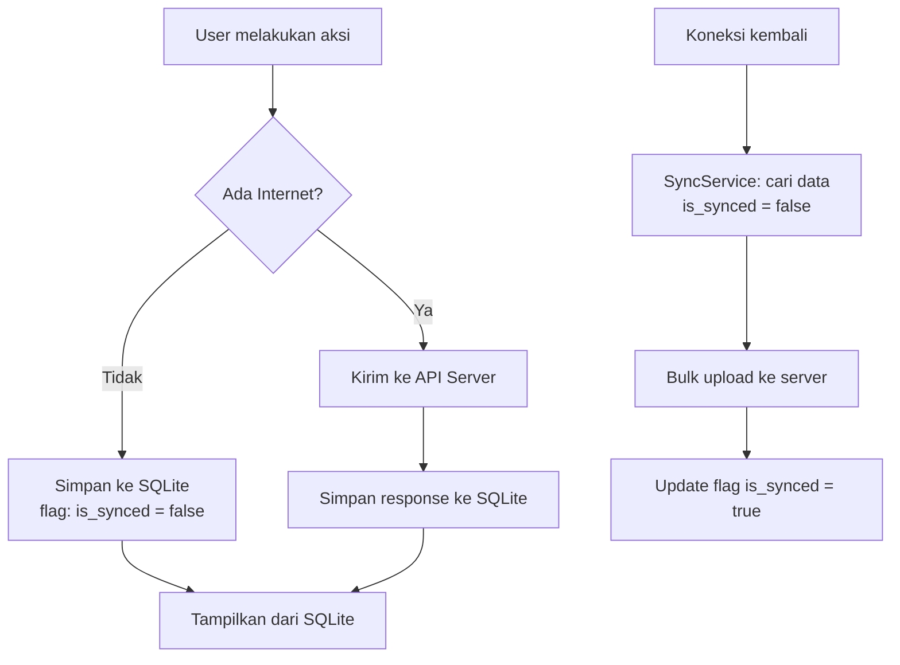

# VegiLog — Aplikasi Pencatat Makan Vegetarian

Aplikasi mobile Android (Flutter) untuk mencatat log makan vegetarian, dilengkapi berita, resep, grup komunitas, dan notifikasi push. Backend menggunakan PHP Native REST API dengan admin panel web.

## Tech Stack

| Layer | Teknologi |
|---|---|
| **Mobile App** | Flutter 3.41.6 (Dart 3.11.4) |
| **Backend API** | PHP 8.2 Native (REST API) |
| **Admin Panel** | PHP + HTML/CSS/JS (Bootstrap 5) |
| **Database** | MySQL (via XAMPP) |
| **Push Notification** | Firebase Cloud Messaging (FCM) |
| **Local Storage** | SQLite (sqflite) + SharedPreferences |
| **Image Upload** | Multipart form-data → server filesystem |

> [!TIP]
> **Mengapa PHP Native?** Karena Anda sudah familiar dengan PHP dan XAMPP sudah ready. Untuk proyek ini PHP native cukup memadai dengan struktur yang rapi. Jika ke depan ingin scale, bisa migrasi ke Laravel.

## Project Structure

```
c:\xampp\htdocs\Vegie\
├── api/                          # PHP REST API Backend
│   ├── config/
│   │   ├── database.php          # MySQL connection
│   │   └── firebase.php          # FCM configuration
│   ├── middleware/
│   │   └── auth.php              # JWT token verification
│   ├── helpers/
│   │   ├── response.php          # JSON response helper
│   │   ├── upload.php            # File upload helper
│   │   └── jwt.php               # JWT encode/decode
│   ├── routes/
│   │   └── api.php               # Route dispatcher
│   ├── controllers/
│   │   ├── AuthController.php
│   │   ├── FoodLogController.php
│   │   ├── NewsController.php
│   │   ├── RecipeController.php
│   │   ├── GroupController.php
│   │   └── NotificationController.php
│   ├── uploads/                  # Uploaded images storage
│   │   ├── food_logs/
│   │   ├── news/
│   │   ├── recipes/
│   │   └── profiles/
│   ├── .htaccess
│   └── index.php                 # Entry point
│
├── admin/                        # Admin Panel Web
│   ├── assets/
│   │   ├── css/
│   │   ├── js/
│   │   └── img/
│   ├── includes/
│   │   ├── header.php
│   │   ├── sidebar.php
│   │   └── footer.php
│   ├── pages/
│   │   ├── dashboard.php
│   │   ├── news/                 # CRUD Berita
│   │   ├── recipes/              # CRUD Resep
│   │   └── users/                # Manage Users
│   ├── login.php
│   └── index.php
│
├── database/
│   └── vegilog.sql               # Database schema
│
└── vegie_app/                    # Flutter Mobile App
    ├── lib/
    │   ├── main.dart
    │   ├── app.dart
    │   ├── config/
    │   │   ├── theme.dart         # Green natural theme
    │   │   ├── constants.dart     # API URLs, keys
    │   │   └── routes.dart        # Named routes
    │   ├── models/
    │   │   ├── user.dart
    │   │   ├── food_log.dart
    │   │   ├── news.dart
    │   │   ├── recipe.dart
    │   │   ├── group.dart
    │   │   └── group_post.dart
    │   ├── services/
    │   │   ├── api_service.dart       # HTTP client wrapper
    │   │   ├── auth_service.dart      # Login/register/token
    │   │   ├── food_log_service.dart
    │   │   ├── news_service.dart
    │   │   ├── recipe_service.dart
    │   │   ├── group_service.dart
    │   │   ├── notification_service.dart  # FCM handler
    │   │   └── sync_service.dart      # Offline sync
    │   ├── database/
    │   │   └── local_db.dart          # SQLite local database
    │   ├── providers/
    │   │   ├── auth_provider.dart
    │   │   ├── food_log_provider.dart
    │   │   ├── news_provider.dart
    │   │   ├── recipe_provider.dart
    │   │   └── group_provider.dart
    │   ├── screens/
    │   │   ├── splash_screen.dart
    │   │   ├── auth/
    │   │   │   ├── login_screen.dart
    │   │   │   ├── register_screen.dart
    │   │   │   └── profile_screen.dart
    │   │   ├── home/
    │   │   │   └── home_screen.dart       # Bottom nav host
    │   │   ├── food_log/
    │   │   │   ├── food_log_screen.dart    # List view
    │   │   │   ├── add_food_log_screen.dart # Camera/gallery
    │   │   │   └── food_log_detail_screen.dart
    │   │   ├── news/
    │   │   │   ├── news_screen.dart
    │   │   │   └── news_detail_screen.dart
    │   │   ├── recipes/
    │   │   │   ├── recipe_screen.dart
    │   │   │   └── recipe_detail_screen.dart
    │   │   ├── groups/
    │   │   │   ├── group_screen.dart
    │   │   │   ├── create_group_screen.dart
    │   │   │   ├── join_group_screen.dart
    │   │   │   └── group_detail_screen.dart
    │   │   └── reports/                    # V2
    │   │       └── report_screen.dart
    │   └── widgets/
    │       ├── custom_app_bar.dart
    │       ├── food_log_card.dart
    │       ├── news_card.dart
    │       ├── recipe_card.dart
    │       ├── group_card.dart
    │       ├── loading_widget.dart
    │       └── empty_state_widget.dart
    ├── assets/
    │   ├── images/
    │   └── fonts/
    ├── android/
    │   └── app/
    │       └── google-services.json    # Firebase config
    └── pubspec.yaml
```

## Database Schema

```sql
-- ============================================
-- DATABASE: vegilog
-- ============================================

CREATE TABLE admins (
    id INT PRIMARY KEY AUTO_INCREMENT,
    username VARCHAR(50) UNIQUE NOT NULL,
    password VARCHAR(255) NOT NULL,
    name VARCHAR(100) NOT NULL,
    created_at TIMESTAMP DEFAULT CURRENT_TIMESTAMP
);

CREATE TABLE users (
    id INT PRIMARY KEY AUTO_INCREMENT,
    name VARCHAR(100) NOT NULL,
    email VARCHAR(100) UNIQUE NOT NULL,
    password VARCHAR(255) NOT NULL,
    photo VARCHAR(255) DEFAULT NULL,
    bio TEXT DEFAULT NULL,
    join_date DATE NOT NULL,
    created_at TIMESTAMP DEFAULT CURRENT_TIMESTAMP,
    updated_at TIMESTAMP DEFAULT CURRENT_TIMESTAMP ON UPDATE CURRENT_TIMESTAMP
);

CREATE TABLE food_logs (
    id INT PRIMARY KEY AUTO_INCREMENT,
    user_id INT NOT NULL,
    photo VARCHAR(255) DEFAULT NULL,
    food_name VARCHAR(200) NOT NULL,
    meal_time DATETIME NOT NULL,
    category ENUM('breakfast','lunch','dinner','snack') NOT NULL,
    nutrition_notes TEXT DEFAULT NULL,
    is_synced TINYINT(1) DEFAULT 1,
    created_at TIMESTAMP DEFAULT CURRENT_TIMESTAMP,
    updated_at TIMESTAMP DEFAULT CURRENT_TIMESTAMP ON UPDATE CURRENT_TIMESTAMP,
    FOREIGN KEY (user_id) REFERENCES users(id) ON DELETE CASCADE
);

CREATE TABLE news (
    id INT PRIMARY KEY AUTO_INCREMENT,
    title VARCHAR(255) NOT NULL,
    content TEXT NOT NULL,
    image VARCHAR(255) DEFAULT NULL,
    is_published TINYINT(1) DEFAULT 0,
    published_at DATETIME DEFAULT NULL,
    created_at TIMESTAMP DEFAULT CURRENT_TIMESTAMP,
    updated_at TIMESTAMP DEFAULT CURRENT_TIMESTAMP ON UPDATE CURRENT_TIMESTAMP
);

CREATE TABLE recipes (
    id INT PRIMARY KEY AUTO_INCREMENT,
    title VARCHAR(255) NOT NULL,
    photo VARCHAR(255) DEFAULT NULL,
    description TEXT DEFAULT NULL,
    calories INT DEFAULT NULL,
    prep_time_minutes INT DEFAULT NULL,
    is_published TINYINT(1) DEFAULT 0,
    published_at DATETIME DEFAULT NULL,
    created_at TIMESTAMP DEFAULT CURRENT_TIMESTAMP,
    updated_at TIMESTAMP DEFAULT CURRENT_TIMESTAMP ON UPDATE CURRENT_TIMESTAMP
);

CREATE TABLE recipe_ingredients (
    id INT PRIMARY KEY AUTO_INCREMENT,
    recipe_id INT NOT NULL,
    ingredient VARCHAR(255) NOT NULL,
    amount VARCHAR(100) DEFAULT NULL,
    sort_order INT DEFAULT 0,
    FOREIGN KEY (recipe_id) REFERENCES recipes(id) ON DELETE CASCADE
);

CREATE TABLE recipe_steps (
    id INT PRIMARY KEY AUTO_INCREMENT,
    recipe_id INT NOT NULL,
    step_number INT NOT NULL,
    description TEXT NOT NULL,
    FOREIGN KEY (recipe_id) REFERENCES recipes(id) ON DELETE CASCADE
);

CREATE TABLE groups_tbl (
    id INT PRIMARY KEY AUTO_INCREMENT,
    name VARCHAR(100) NOT NULL,
    description TEXT DEFAULT NULL,
    code VARCHAR(8) UNIQUE NOT NULL,
    created_by INT NOT NULL,
    photo VARCHAR(255) DEFAULT NULL,
    created_at TIMESTAMP DEFAULT CURRENT_TIMESTAMP,
    FOREIGN KEY (created_by) REFERENCES users(id) ON DELETE CASCADE
);

CREATE TABLE group_members (
    id INT PRIMARY KEY AUTO_INCREMENT,
    group_id INT NOT NULL,
    user_id INT NOT NULL,
    role ENUM('admin','member') DEFAULT 'member',
    joined_at TIMESTAMP DEFAULT CURRENT_TIMESTAMP,
    UNIQUE KEY (group_id, user_id),
    FOREIGN KEY (group_id) REFERENCES groups_tbl(id) ON DELETE CASCADE,
    FOREIGN KEY (user_id) REFERENCES users(id) ON DELETE CASCADE
);

CREATE TABLE group_posts (
    id INT PRIMARY KEY AUTO_INCREMENT,
    group_id INT NOT NULL,
    user_id INT NOT NULL,
    content TEXT NOT NULL,
    type ENUM('text','achievement','quote') DEFAULT 'text',
    created_at TIMESTAMP DEFAULT CURRENT_TIMESTAMP,
    FOREIGN KEY (group_id) REFERENCES groups_tbl(id) ON DELETE CASCADE,
    FOREIGN KEY (user_id) REFERENCES users(id) ON DELETE CASCADE
);

CREATE TABLE user_fcm_tokens (
    id INT PRIMARY KEY AUTO_INCREMENT,
    user_id INT NOT NULL,
    token TEXT NOT NULL,
    device_info VARCHAR(255) DEFAULT NULL,
    created_at TIMESTAMP DEFAULT CURRENT_TIMESTAMP,
    updated_at TIMESTAMP DEFAULT CURRENT_TIMESTAMP ON UPDATE CURRENT_TIMESTAMP,
    FOREIGN KEY (user_id) REFERENCES users(id) ON DELETE CASCADE
);

CREATE TABLE notifications (
    id INT PRIMARY KEY AUTO_INCREMENT,
    title VARCHAR(255) NOT NULL,
    body TEXT NOT NULL,
    type ENUM('news','recipe','group','system') NOT NULL,
    reference_id INT DEFAULT NULL,
    sent_at TIMESTAMP DEFAULT CURRENT_TIMESTAMP
);
```

## API Endpoints

### Authentication
| Method | Endpoint | Description |
|--------|----------|-------------|
| POST | `/api/auth/register` | Register akun baru |
| POST | `/api/auth/login` | Login, return JWT token |
| GET | `/api/auth/profile` | Get user profile |
| PUT | `/api/auth/profile` | Update profile (name, bio, photo) |
| POST | `/api/auth/fcm-token` | Register FCM token |

### Food Logs (🔐 Auth Required)
| Method | Endpoint | Description |
|--------|----------|-------------|
| GET | `/api/food-logs` | List food logs user |
| POST | `/api/food-logs` | Tambah log baru (+ upload foto) |
| PUT | `/api/food-logs/{id}` | Edit log |
| DELETE | `/api/food-logs/{id}` | Hapus log |
| POST | `/api/food-logs/sync` | Bulk sync dari offline |

### News
| Method | Endpoint | Description |
|--------|----------|-------------|
| GET | `/api/news` | List berita (paginated) |
| GET | `/api/news/{id}` | Detail berita |

### Recipes
| Method | Endpoint | Description |
|--------|----------|-------------|
| GET | `/api/recipes` | List resep (paginated) |
| GET | `/api/recipes/{id}` | Detail resep + bahan + langkah |

### Groups (🔐 Auth Required)
| Method | Endpoint | Description |
|--------|----------|-------------|
| POST | `/api/groups` | Buat grup baru |
| POST | `/api/groups/join` | Gabung grup via kode |
| GET | `/api/groups` | List grup user |
| GET | `/api/groups/{id}` | Detail grup + members |
| POST | `/api/groups/{id}/posts` | Post text/achievement/quote |
| GET | `/api/groups/{id}/posts` | List posts (paginated) |
| DELETE | `/api/groups/{id}/leave` | Keluar dari grup |

### Notifications
| Method | Endpoint | Description |
|--------|----------|-------------|
| GET | `/api/notifications` | List notifikasi |

## User Review Required

> [!IMPORTANT]
> **Firebase Setup**: Anda perlu membuat project Firebase terlebih dahulu di [Firebase Console](https://console.firebase.google.com/), kemudian download `google-services.json` untuk Android app. Saya akan siapkan kode FCM-nya, tapi file config harus dari project Firebase Anda sendiri.

> [!IMPORTANT]
> **Database Name**: Saya akan menggunakan nama database `vegilog`. Apakah ini OK, atau ada preferensi lain?

> [!WARNING]
> **Server API URL**: Untuk development, Flutter app akan connect ke IP lokal PC Anda (misal `http://192.168.x.x/Vegie/api/`). Untuk production nanti perlu hosting/VPS dengan domain. Harap pastikan HP Android dan PC berada di jaringan WiFi yang sama saat development.

## Design System — Green Natural Theme

### Color Palette
| Token | Hex | Usage |
|-------|-----|-------|
| Primary | `#2D6A4F` | App bar, buttons, active states |
| Primary Light | `#40916C` | Hover states, secondary elements |
| Primary Dark | `#1B4332` | Status bar, emphasis text |
| Accent | `#95D5B2` | Chips, tags, soft backgrounds |
| Accent Light | `#D8F3DC` | Card backgrounds, surfaces |
| Background | `#F8FBF9` | Page background |
| Surface | `#FFFFFF` | Cards, dialogs |
| On Primary | `#FFFFFF` | Text on primary color |
| Text Primary | `#1B1B1B` | Headings, body text |
| Text Secondary | `#6B7280` | Captions, hints |
| Error | `#DC3545` | Validation errors |
| Warning | `#F59E0B` | Warnings |
| Success | `#10B981` | Success states |

### Typography
- **Font**: Google Fonts — **Poppins** (headings) + **Inter** (body)
- Rounded corners (12-16px radius) untuk feel organic/natural
- Subtle leaf/plant decorative elements

### App Navigation
Bottom Navigation Bar dengan 5 tab:
1. 🏠 **Home** — Dashboard overview
2. 🍽️ **Food Log** — Catatan makan
3. 📰 **Berita** — Berita vegetarian
4. 🥗 **Resep** — Resep makanan
5. 👥 **Grup** — Komunitas

Profile accessible via avatar icon di app bar.

## Implementation Phases

### Phase 1: Backend Foundation 
**Scope**: Database, API structure, Authentication, Admin panel skeleton

**Files to create:**
- `database/vegilog.sql` — Full database schema
- `api/index.php` — Entry point + router
- `api/.htaccess` — URL rewriting
- `api/config/database.php` — MySQL PDO connection
- `api/helpers/response.php` — JSON response helper
- `api/helpers/jwt.php` — JWT implementation (using php-jwt or manual HMAC)
- `api/helpers/upload.php` — Image upload handler
- `api/middleware/auth.php` — JWT verification middleware
- `api/controllers/AuthController.php` — Register, Login, Profile
- `admin/login.php`, `admin/index.php` — Admin auth + dashboard

**Verification**: Test API endpoints via browser/Postman

---

### Phase 2: Flutter App Core — Auth + Food Log
**Scope**: Flutter project setup, theme, auth screens, food log with camera/gallery + offline support

**Flutter packages needed:**
```yaml
dependencies:
  provider: ^6.1.2          # State management
  http: ^1.2.1              # HTTP requests
  image_picker: ^1.0.7      # Camera & Gallery
  sqflite: ^2.3.2           # Local SQLite
  path_provider: ^2.1.2     # File paths
  shared_preferences: ^2.2.2 # Token storage
  intl: ^0.19.0             # Date formatting
  cached_network_image: ^3.3.1  # Image caching
  connectivity_plus: ^6.0.3 # Network status
  google_fonts: ^6.2.1      # Poppins + Inter fonts
  shimmer: ^3.0.0           # Loading skeleton
  flutter_staggered_animations: ^1.1.1  # List animations
```

**Key features:**
- Splash screen → Login/Register
- Profile setup & edit
- Food log CRUD with photo (camera/gallery via `image_picker`)
- SQLite local database for offline storage
- Auto-sync when connection restored
- Pull-to-refresh pada list views
- Animated transitions

**Verification**: Run on Android emulator/device, test offline mode

---

### Phase 3: News & Recipes
**Scope**: Backend CRUD admin panel + API + Flutter screens

**Backend:**
- `api/controllers/NewsController.php`
- `api/controllers/RecipeController.php`
- `admin/pages/news/` — CRUD berita (list, create, edit, delete)
- `admin/pages/recipes/` — CRUD resep + ingredients + steps

**Flutter:**
- News list screen (card layout dengan gambar)
- News detail screen (full article view)
- Recipe list screen (grid layout dengan foto & kalori)
- Recipe detail screen (foto, bahan, langkah masak, info kalori)
- Local caching untuk offline reading

**Verification**: Create sample news/recipe via admin, verify tampil di app

---

### Phase 4: Groups Feature
**Scope**: Create/join group, post text & achievements via kode unik

**Backend:**
- `api/controllers/GroupController.php`

**Flutter:**
- Group list screen
- Create group screen (auto-generate kode 6 karakter)
- Join group screen (input kode)
- Group detail screen (members + posts feed)
- Post creation (text/quote/achievement)
- Share group code functionality

**Verification**: Create group, join with code from different account, post & verify

---

### Phase 5: Push Notifications (FCM)
**Scope**: Firebase integration, notification handling

**Backend:**
- `api/config/firebase.php` — FCM server key config
- `api/controllers/NotificationController.php` — Send via FCM HTTP v1 API
- Admin panel: "Send Notification" button saat publish berita/resep baru

**Flutter:**
- `firebase_messaging` package integration
- Foreground & background notification handling
- Notification tap → navigate to relevant screen
- FCM token registration on login

**Packages tambahan:**
```yaml
  firebase_core: ^3.3.0
  firebase_messaging: ^15.0.4
  flutter_local_notifications: ^17.2.1
```

> [!NOTE]
> **Prerequisite**: Anda perlu membuat Firebase project dan download `google-services.json` sebelum Phase 5 bisa dijalankan.

**Verification**: Publish berita via admin → notifikasi muncul di app

---

### Phase 6 (V2 — Nanti): Reports & Analytics
**Scope**: Streak harian, statistik, grafik, badge achievement

Ini akan dikerjakan di versi berikutnya sesuai permintaan Anda. Saya akan menyiapkan placeholder screen dan data model yang sudah mengakomodasi fitur ini.

## Offline Support Strategy



**Yang bisa offline:**
- ✅ Tambah food log (foto disimpan lokal)
- ✅ Lihat food log yang sudah di-cache
- ✅ Baca berita/resep yang sudah di-cache
- ❌ Fitur grup (perlu real-time)
- ❌ Register/Login (perlu server)

## Verification Plan

### Automated Tests
```bash
# Backend API test
# Test via curl/Postman untuk setiap endpoint

# Flutter build test  
flutter build apk --debug
flutter analyze
```

### Manual Verification
1. **Auth flow**: Register → Login → Edit Profile → Logout
2. **Food log**: Tambah log (camera) → Tambah log (gallery) → Edit → Delete
3. **Offline**: Matikan WiFi → Tambah log → Nyalakan WiFi → Verify sync
4. **Admin**: Login admin → Buat berita → Buat resep → Verify di app
5. **Groups**: Buat grup → Share code → Join → Post → Verify
6. **FCM**: Publish berita → Verify notifikasi muncul di app
7. **UI/UX**: Check semua animasi, loading states, empty states, error states

## Open Questions

> [!IMPORTANT]
> 1. **Apakah nama database `vegilog` sudah OK?**
> 2. **Apakah Anda sudah punya project Firebase?** Jika belum, saya bisa guide prosesnya.
> 3. **Untuk Phase pertama, mau mulai dari Backend dulu atau Flutter app dulu?** Saya rekomendasikan Backend dulu agar Flutter bisa langsung connect ke API.
